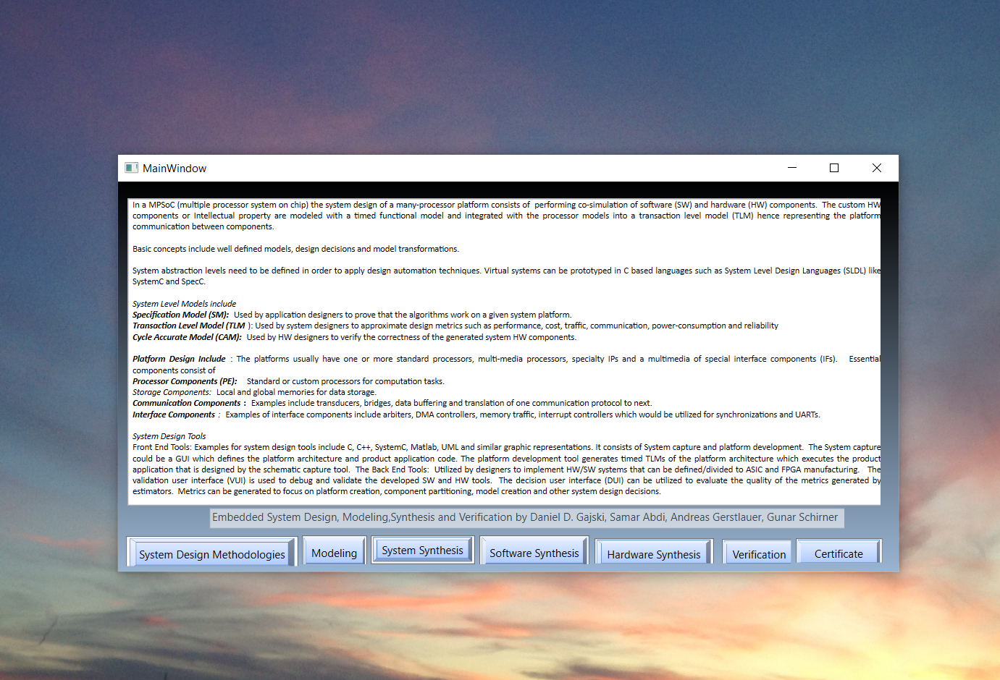
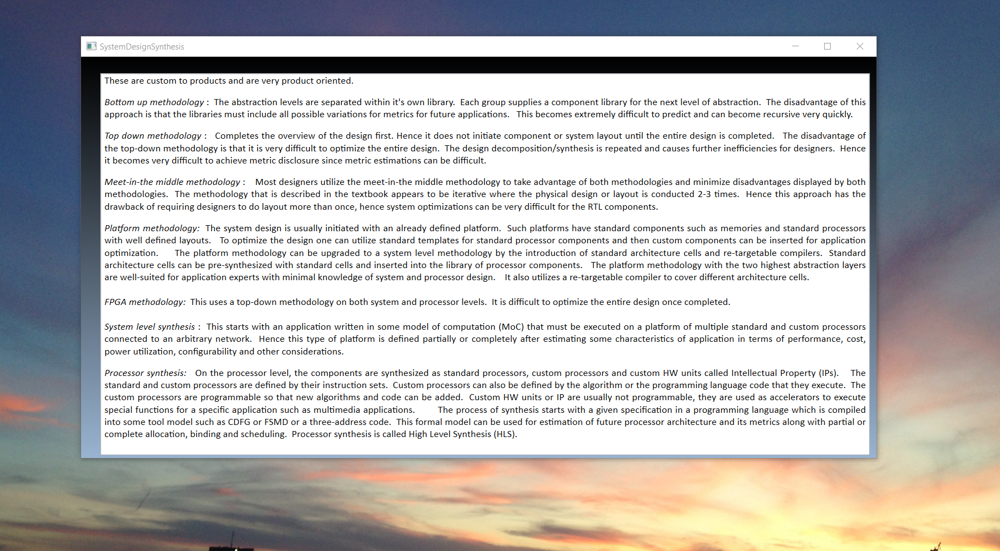
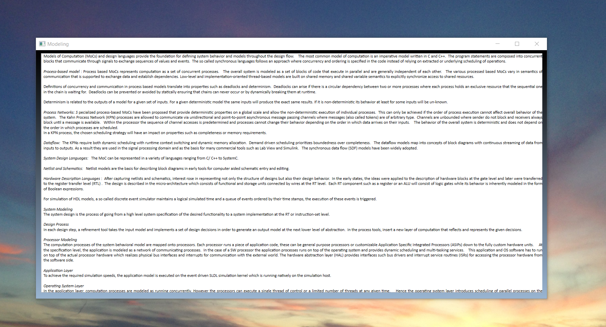
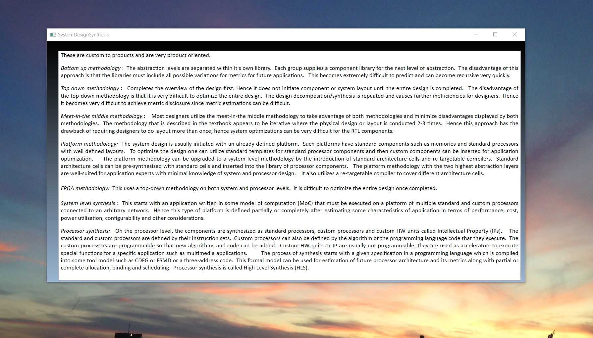
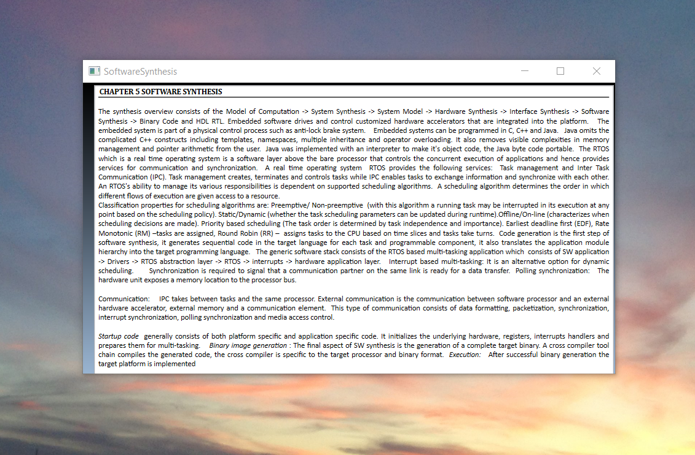
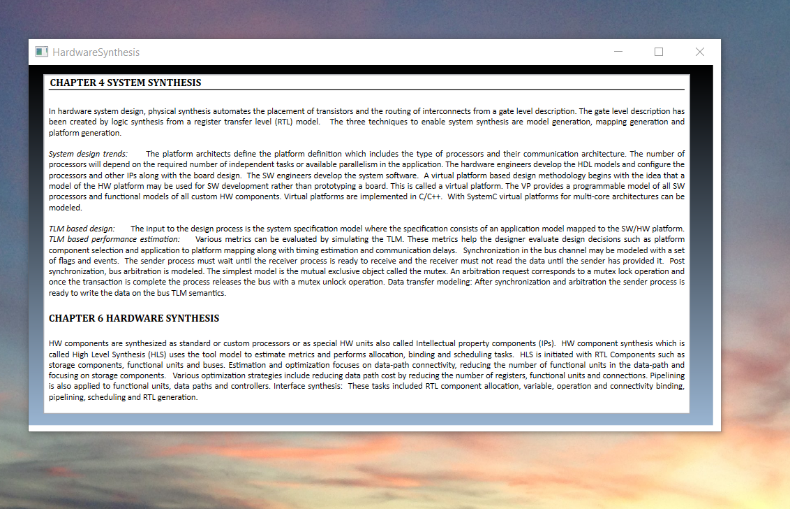
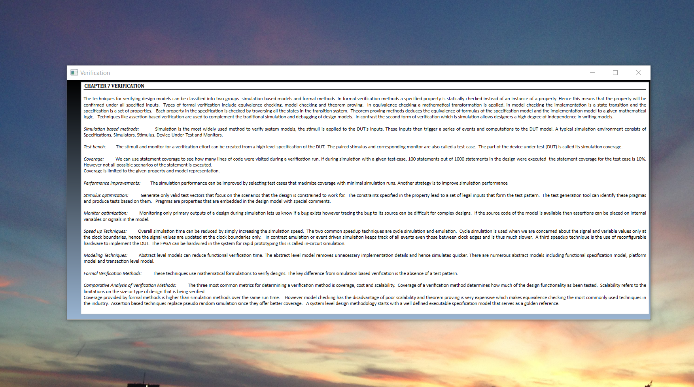

# ModelsofComputationandSynthesis

The project consists of an overview of Models of Computation and Synthesis. For details launch the executable from https://github.com/alpaddesai/Microarchitecture/releases

All images are either custom by Alpa D Desai or a reference name is included. Most of the images are custom. Company confidential information is not displayed.

## Embedded Systems Design 

## System Design Synthesis

## Modeling

## System Synthesis

## Software Synthesis

## Hardware Synthesis

## Verification 

